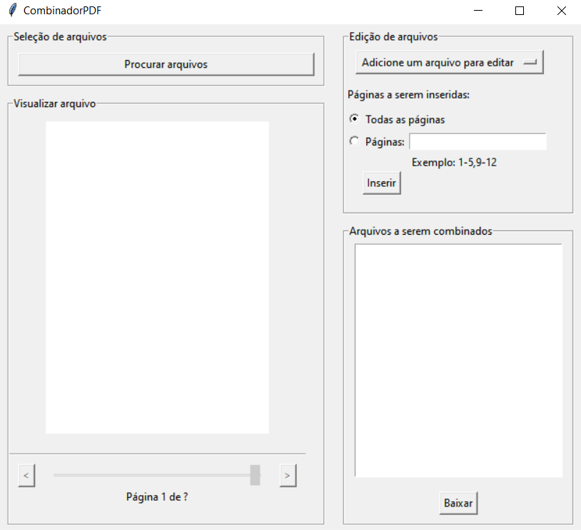
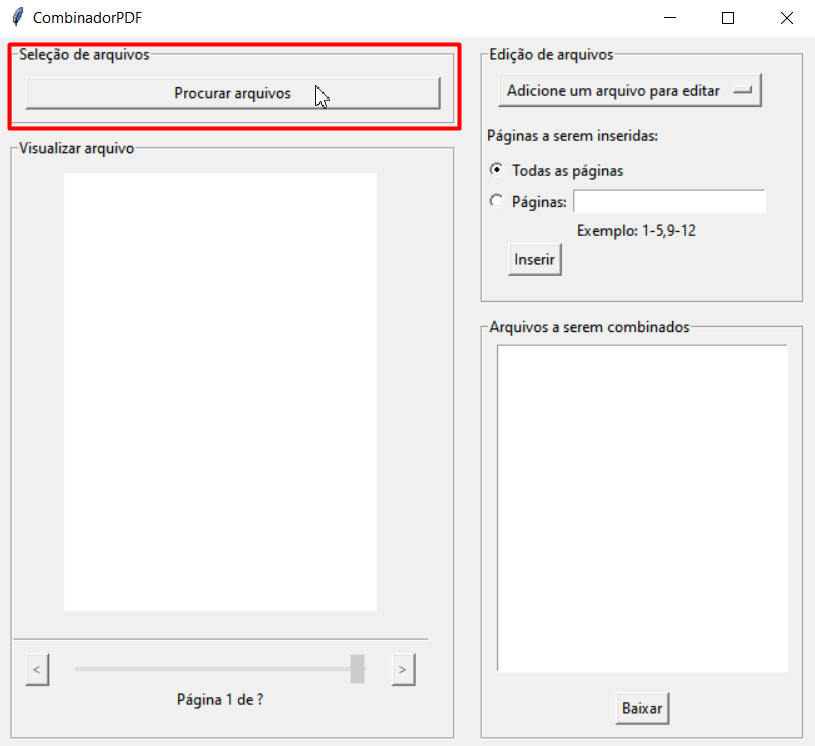
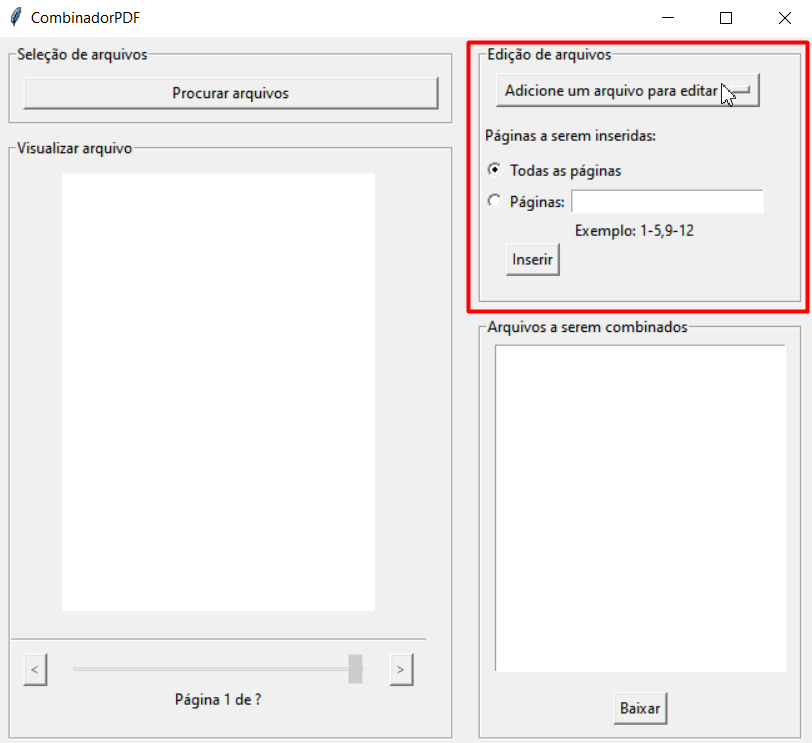
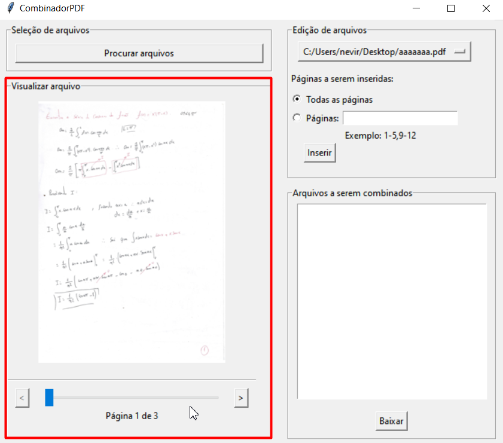
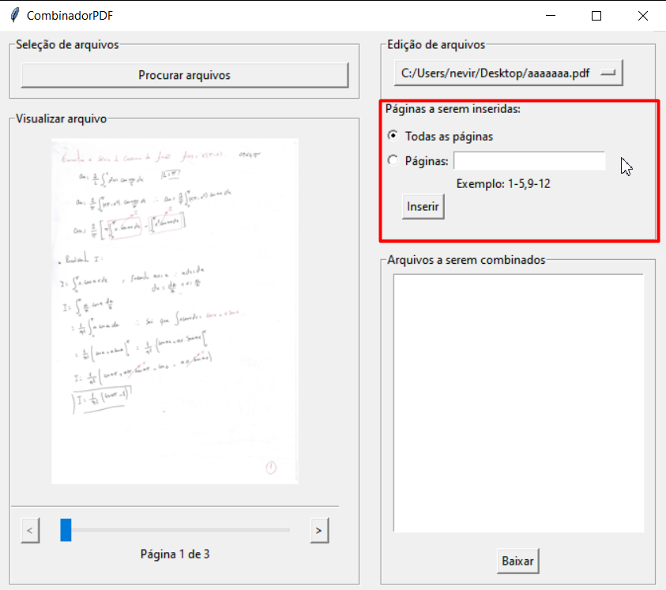
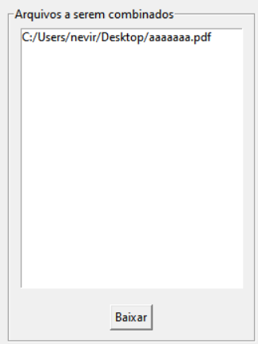
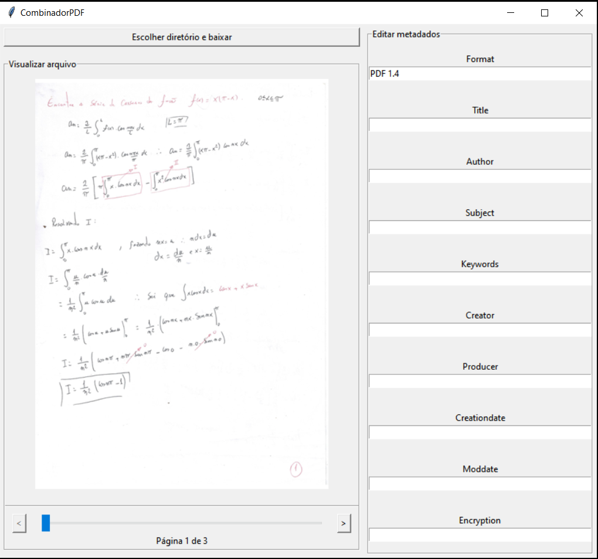

# Tutorial

Ao executar, o programa deve abrir uma janela como essa

## Carregue arquivos pdf para edição
Clique em procurar arquivos e selecione todos os pdfs que deseja editar e combinar

## Selecione os arquivos carregados
No frame edição de arquivos, selecione os arquivos que deseja combinar em ordem

Se você seguiu os passos corretamente até aqui, o pdf aparecerá no frame Visualizar arquivo, onde você pode visualizar as páginas do pdf selecionado.

## Editando o pdf
No frame edição de arquivos, você pode adicionar o pdf completamente sem edições ao clicar o botão Inserir com a opção Todas as páginas selecionada ou pegar apenas intervalos de páginas.

Separe os intervalos de página com -
Se houver mais de um intervalo, separe-os com ,

## Salvando mudanças
Após inserir todos os pdfs que deseja combinar, eles devem estar listados no frame Arquivos a serem combinados.
Clique em Baixar

Uma janela com um preview do pdf combinado e um frame que te permite adicionar metadados ao pdf será aberta.
Para baixar o pdf, clique o botão 'Escolher diretório e baixar' para salvar o novo arquivo.

