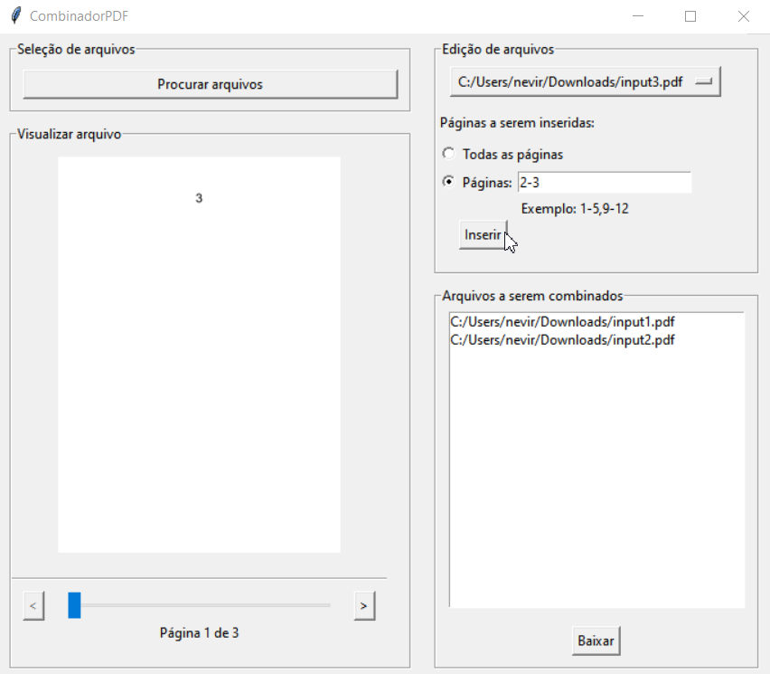

# Exemplo
Inserindo 3 arquivos para esse exemplo, com apenas as duas últimas páginas do input3.pdf

[input1.pdf](files/input1.pdf)

[input2.pdf](files/input2.pdf)

[input3.pdf](files/input3.pdf)

Arquivo de saída nomeado output.pdf:

[output.pdf](files/output.pdf)

